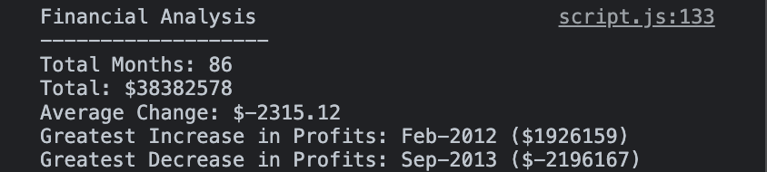

# Console Finances Challenge

## Description

For this challenge, I created JavaScript code to analyse the profits/losses of a company over a certain period of time. With the dataset given, I wanted to find out the following information:
- The number of months included 
- The net total of profits/losses over the whole duration shown in the dataset
- The average change in profits/losses from month to month
- Th greatest increase/decrease of profits/losses over the entire period

To do this, I had to deal with nested arrays and primarily use loops to analyse the dataset. I then logged the resulting analysis into the console of the browser as one complete string. 

## Installation 

N/A

## Usage

The webpage has been deployed on GitHub Pages (link: https://cedekpoole.github.io/console-finances/). In order to see the results of the analysis, you must open the developer console on Google Chrome (Option + Command + J on MacOS, Shift + Control + J on Windows/Linux).

As you can see above, all the information has been laid out in a singular string.

## Credits

N/A

## License

N/A

